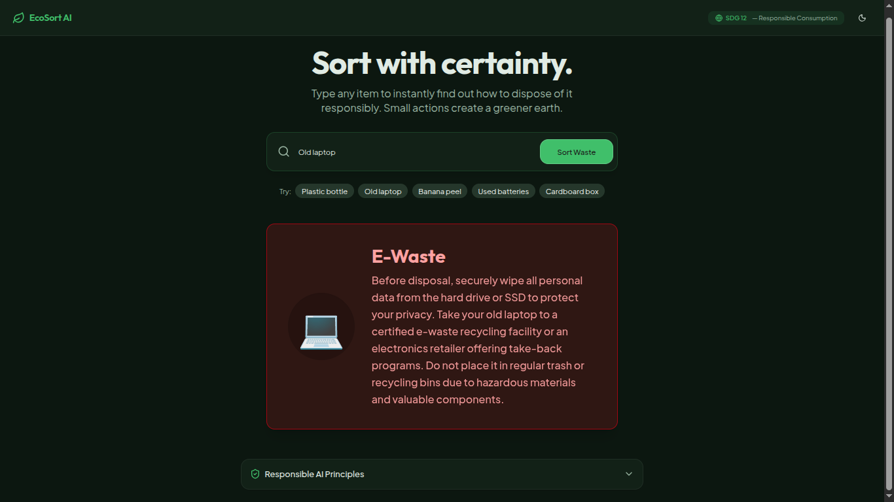
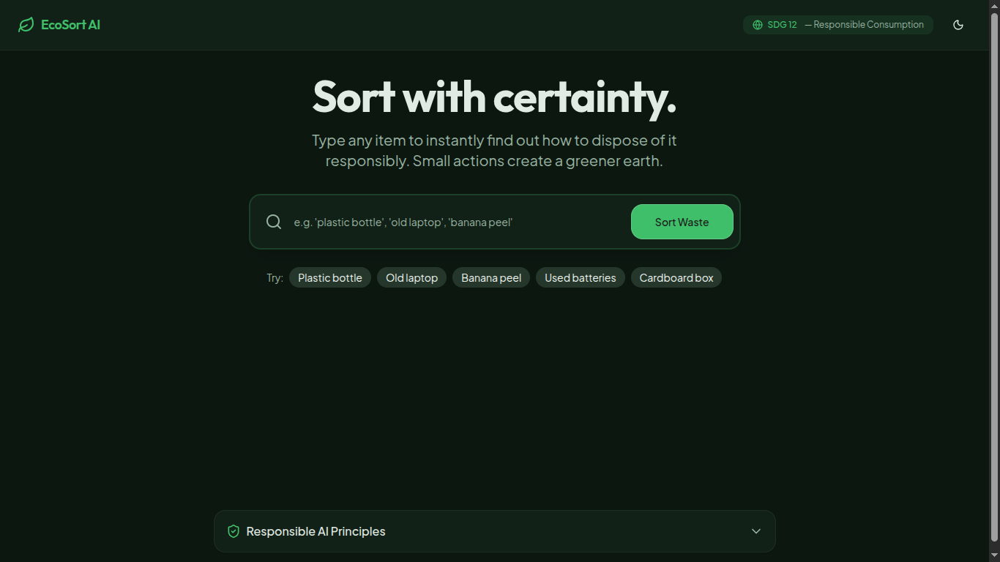
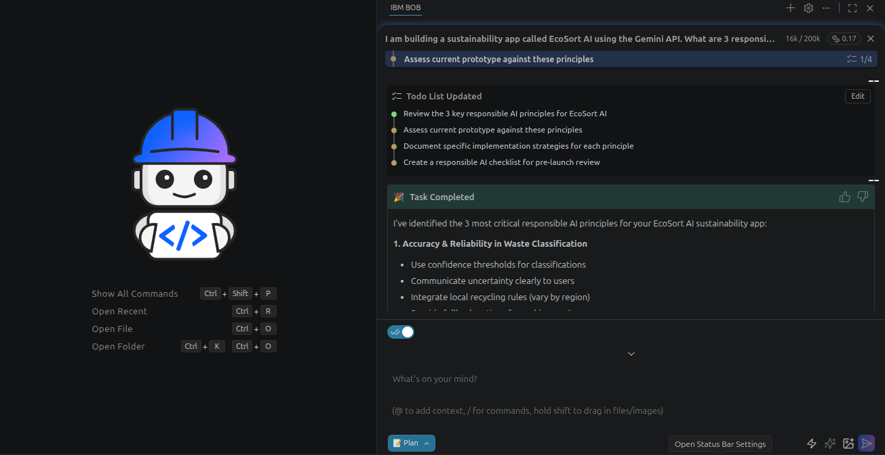

# 🌍 EcoSort AI
**Intelligent Waste Categorization & UN SDG Mapping Engine**

  
  
  
  
  
  

EcoSort AI is a full-stack web application built during the **AI for Sustainability Virtual Internship** by 1M1B & IBM SkillsBuild, supported by AICTE. It utilizes Agentic AI workflows to categorize waste and map it to UN Sustainable Development Goals (SDGs).

🔗 **Live Production Application:** [https://ecosort-frontend-bnpg.onrender.com/](https://ecosort-frontend-bnpg.onrender.com/)

---

## 📸 Interface Showcase

| Waste Categorization Studio | UN SDG Mapping & Impact |
| :---: | :---: |
|  |  |

| Environmental Analytics Dashboard |
| :---: |
|  |

---
- **Frontend:** React, Vite, TypeScript, Tailwind CSS, Radix UI
- **Backend Architecture:** Node.js (Deployed via Render)
- **AI Integration:** Agentic Workflows via Google Gemini API
- **Package Manager:** pnpm (Monorepo architecture)

## 🚀 Features
- **AI-Powered Categorization:** Accurately sorts waste inputs based on environmental impact.
- **SDG Mapping:** Connects real-time waste data to actionable UN Sustainability Goals.
- **Modern UI/UX:** Built with Tailwind CSS and Radix UI primitives for a sleek, accessible interface.

## 👨‍💻 Author
**Tanmay Jain** 
- [LinkedIn](https://www.linkedin.com/in/tanmay-jain-dev)
- [GitHub](https://github.com/TanmayJain-dev)